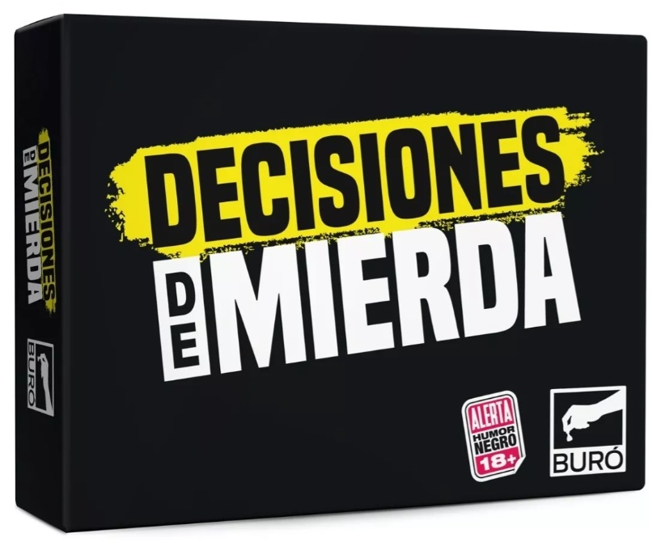
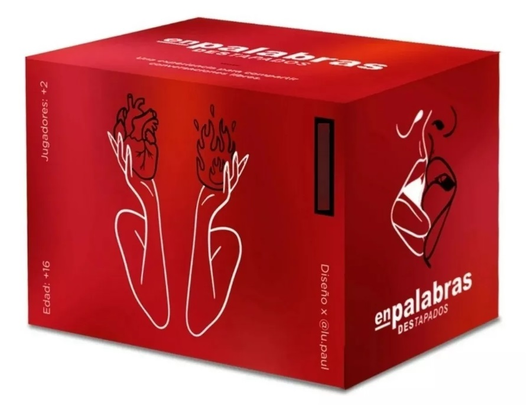
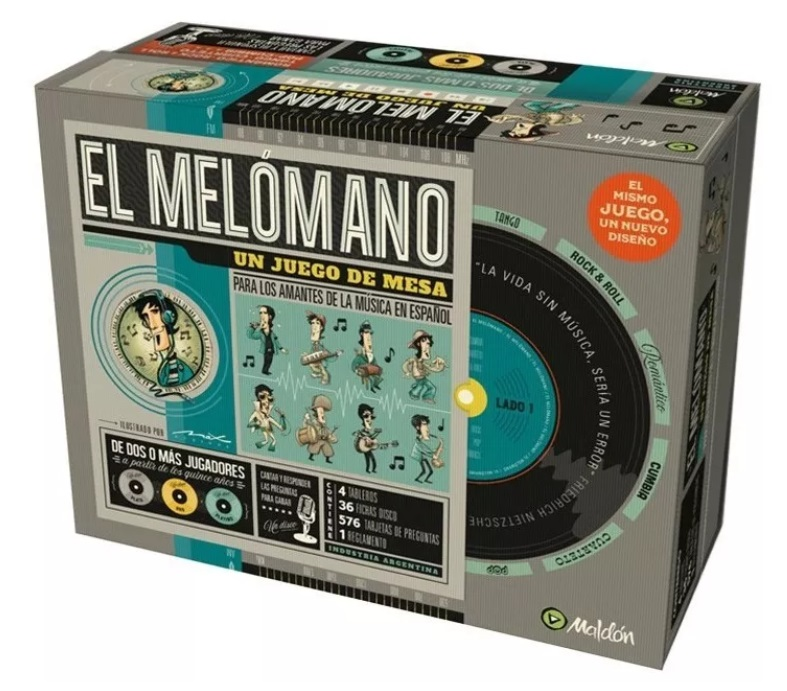
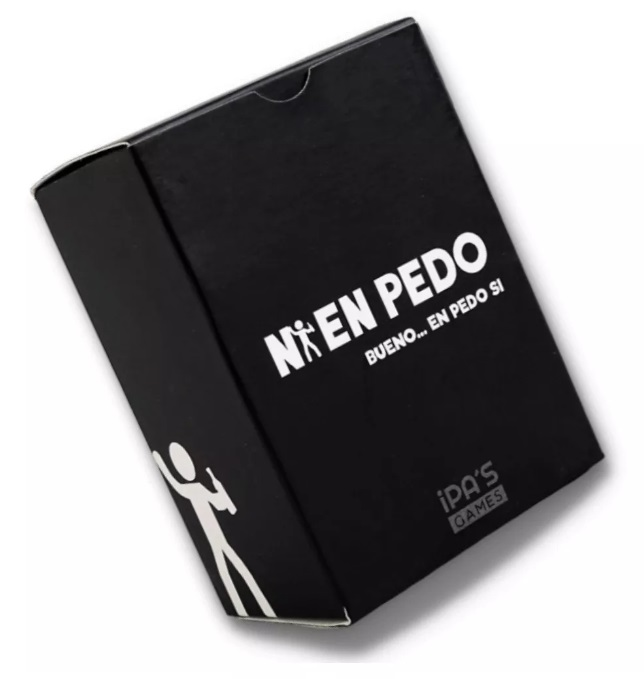
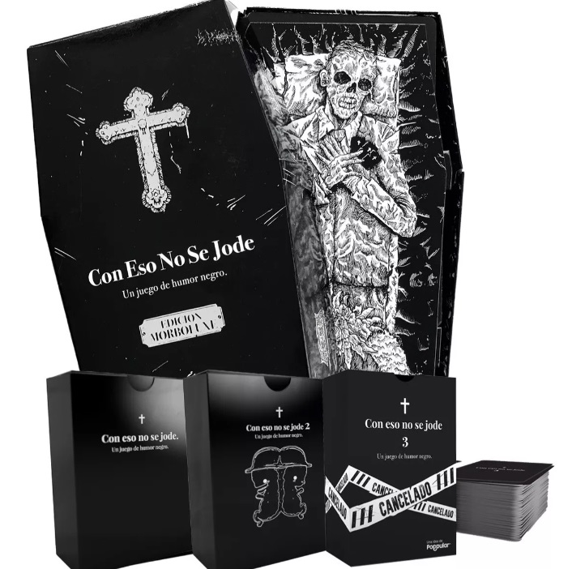
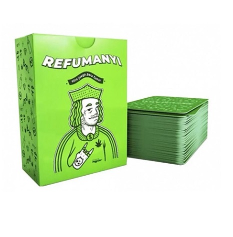
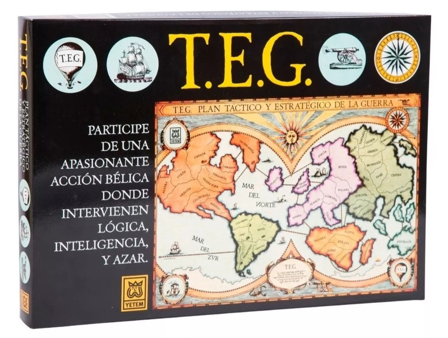
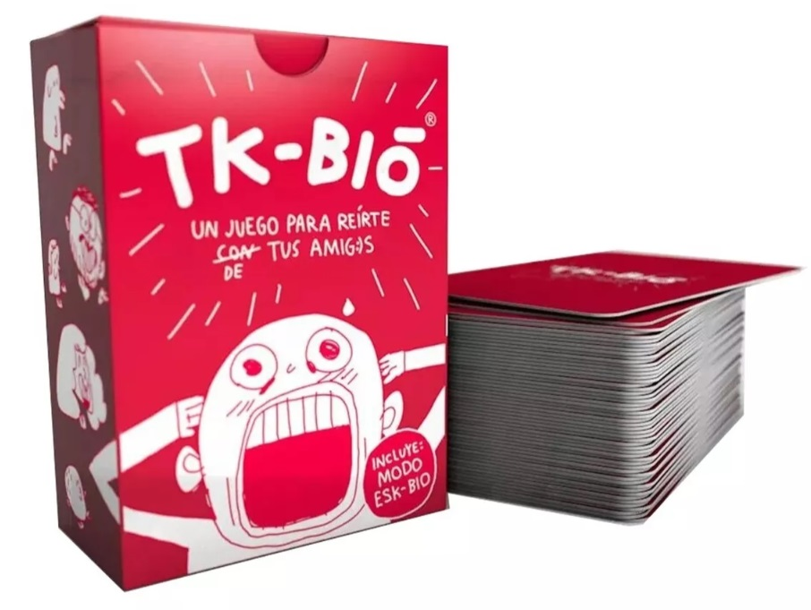
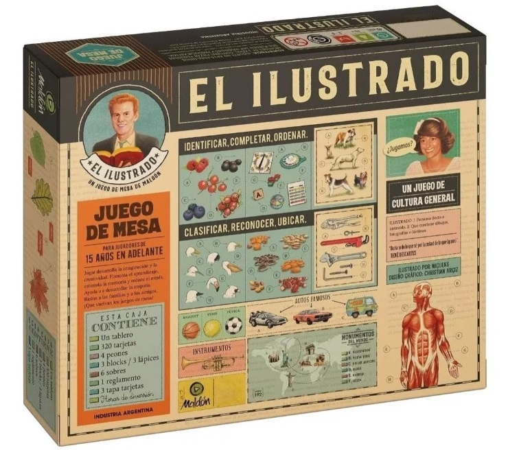

# Manejo de NPM

# Instalar dependencia de PROYECTO:
Se va a agregar una propiedad en package.json => dependencies
https://npmjs.com/package/bootstrap

npm i <nombre-de-dependencia>
npm i bootstrap@latest #Ultima version
npm i bootstrap@5.0.1 #Instalación de versión específica

# Para instalar una dependencia (libreria, biblioteca) de DESARROLLO:
npm i <nombre-de-dependencia>
npm i nombreDependencia --save-dev #versión de bandera (flag)
npm i vite@latest -D #Versión corta

# Para desinstalar una dependencia
npm uninstall <nombre-el-paquete>

# ¿Que significan los simbolos en las dependencias y devDependencias?
= o (sin simibolo): Congelo la versión actual y no se actualiza a menos que específicamente le diga

(caret) [acento circunflejo]: Va a congelar solo la versión mayor (primer numerito), va a poder actualizarse a versiones compatibles y parches

 (virgurilla) [tilde ]: va a congelar la version mayor y menor, solo se va a poder actualizar los parches (el 3er numerito)

## IMPORTANTE: Hay varias herramientas para el manejo de dependencias:
* npm
* yarn
* pnpm

**NOTA**: Si empiezo a trabajar un poroyecto con npm, no cambio de herramienta durante todo el proceso o ciclo de vida del desarrollo. Lo mismo con yarn y pnpm.

# Para verificar si hay una nueva versión de la lkibrería que tengo:
npm outdated: Me permite chequear con respecto al repositorio de npmjs, si hay una actualización de las librerías que estoy usando

        

          
          

            <h5 class="card-title m-0">Decisiones de mierda</h5>
            

            <ul class="list-unestyled mt-3 mb-3 p-0">
              <li class="list-group-item d-flex align-center jugadores">
                <i
                  class="fa-solid fa-user fa-xl mt-2 mx-2"
                  style="color: #22a699"
                ></i>
                
<b>2 - 4 </b>(+18 años)

              </li>
              <li class="list-group-item mx-1">
                ¿Crees que tus amigos toman malas decisiones? Conocé nuevos
                aspectos oscuros (muy oscuros) de tus amigos...
              </li>
              <li class="list-group-item mx-1">$4.990</li>
            </ul>
            <a href="#" class="btn btn-card">Comprar</a>
          

        

        <!-- card col-3 m-3 -->

        

          
          

            <h5 class="card-title m-0">En palabras - Destapados</h5>
            

            <ul class="list-unestyled mt-3 mb-3 p-0">
              <li class="list-group-item d-flex align-center jugadores">
                <i
                  class="fa-solid fa-user fa-xl mt-2 mx-2"
                  style="color: #22a699"
                ></i>
                
<b>+2 </b>(+18 años)

              </li>
              <li class="list-group-item mx-1">
                Disparador de encuentros festivos e íntimos, corporales y
                emocionales. Las cartas buscan destapar estereotipos y
                prejuicios...
              </li>
              <li class="list-group-item mx-1">$8.900</li>
            </ul>
            <a href="#" class="btn btn-card">Comprar</a>
          

        

        

          
          

            <h5 class="card-title m-0">El melómano</h5>
            

            <ul class="list-unestyled mt-3 mb-3 p-0">
              <li class="list-group-item d-flex align-center jugadores">
                <i
                  class="fa-solid fa-user fa-xl mt-2 mx-2"
                  style="color: #22a699"
                ></i>
                
<b>+ 4</b>

              </li>
              <li class="list-group-item mx-1">
                El Melómano es un juego de mesa para los amantes de la música.
                ¡Quién primero consiga los 3 discos de Platino será el ganador!
              </li>
              <li class="list-group-item mx-1">$14.000</li>
            </ul>
            <a href="#" class="btn btn-card">Comprar</a>
          

        

        

          
          

            <h5 class="card-title m-0">Ni en Pedo</h5>
            

            <ul class="list-unestyled mt-3 mb-3 p-0">
              <li class="list-group-item d-flex align-center jugadores">
                <i
                  class="fa-solid fa-user fa-xl mt-2 mx-2"
                  style="color: #22a699"
                ></i>
                
<b>2 - 8 </b>(+18 años)

              </li>
              <li class="list-group-item mx-1">
                Coloca el mazo en la mesa, saca una carta y ¡que comience el
                juego! Si no haces lo que dice, como castigo, toma unos
                tragos!!!
              </li>
              <li class="list-group-item mx-1">$4.700</li>
            </ul>
            <a href="#" class="btn btn-card">Comprar</a>
          

        

        

          
          

            <h5 class="card-title m-0">Con eso no se jode</h5>
            

            <ul class="list-unestyled mt-3 mb-3 p-0">
              <li class="list-group-item d-flex align-center jugadores">
                <i
                  class="fa-solid fa-user fa-xl mt-2 mx-2"
                  style="color: #22a699"
                ></i>
                
<b>3 - 10 </b>(+18 años)

              </li>
              <li class="list-group-item mx-1">
                Juego de cartas de humor negro para pasar un divertido momento
                con amigos o familia, en previas, juntadas y cumpleaños. +18
              </li>
              <li class="list-group-item mx-1">$5.400</li>
            </ul>
            <a href="#" class="btn btn-card">Comprar</a>
          

        

        

          
          

            <h5 class="card-title m-0">Refumany</h5>
            

            <ul class="list-unestyled mt-3 mb-3 p-0">
              <li class="list-group-item d-flex align-center jugadores">
                <i
                  class="fa-solid fa-user fa-xl mt-2 mx-2"
                  style="color: #22a699"
                ></i>
                
<b>2 - 4</b>(+18 años)

              </li>
              <li class="list-group-item mx-1">
                Cada carta tiene una consigna para que fume uno, todos o
                nadie.¡Gana el que después de varias rondas fuma la última
                pitada! +18
              </li>
              <li class="list-group-item mx-1">$6.200</li>
            </ul>

            <a href="#" class="btn btn-card">Comprar</a>
          

        

        

          
          

            <h5 class="card-title m-0">T.E.G</h5>
            

            <ul class="list-unestyled mt-3 mb-3 p-0">
              <li class="list-group-item d-flex align-center jugadores">
                <i
                  class="fa-solid fa-user fa-xl mt-2 mx-2"
                  style="color: #22a699"
                ></i>
                
<b>2 - 6 </b>(+12 años)

              </li>
              <li class="list-group-item mx-1">
                ¡Poné a prueba tu inteligencia y táctica en la batalla por
                conquistar el mundo! Cumplí las misiones y derribá a tus
                oponentes...
              </li>
              <li class="list-group-item mx-1">$21.200</li>
            </ul>
            <a href="#" class="btn btn-card">Comprar</a>
          

        

        

          
          

            <h5 class="card-title m-0">Tk-bió</h5>
            

            <ul class="list-unestyled mt-3 mb-3 p-0">
              <li class="list-group-item d-flex align-center jugadores">
                <i
                  class="fa-solid fa-user fa-xl mt-2 mx-2"
                  style="color: #22a699"
                ></i>
                
<b>3 - 10 </b>(+18 años)

              </li>
              <li class="list-group-item mx-1">
                Un juego para disfrutar de lo más hermoso que tiene la amistad:
                LA MALDAD. Consignas llenas de venganza, sufrimiento y cringe...
              </li>
              <li class="list-group-item mx-1">$3.500</li>
            </ul>
            <a href="#" class="btn btn-card">Comprar</a>
          

        

        

          
          

            <h5 class="card-title m-0">El ilustrado</h5>
            

            <ul class="list-unestyled mt-3 mb-3 p-0">
              <li class="list-group-item d-flex align-center jugadores">
                <i
                  class="fa-solid fa-user fa-xl mt-2 mx-2"
                  style="color: #22a699"
                ></i>
                
<b>2 - 9 </b>(+15 años)

              </li>
              <li class="list-group-item mx-1">
               Poné a prueba tus habilidades y
                conocimientos en distintas áreas, mientras compartís momentos
                inolvidables con tus seres queridos
              </li>
              <li class="list-group-item mx-1">$15.850</li>
            </ul>
            <a href="#" class="btn btn-card">Comprar</a>
          

        

        ABOUT US 

              <section id="about">
        

          

            

              ¿QUIEN NO HA JUGADO JUEGOS DE MESA DE PEQUEÑO? SOMOS UNA EMPRESA
              CONVENCIDA DE QUE PODEMOS CONTINUAR CON LA DIVERSION MAS ALLA DE
              LAS EDADES. PARA AQUELLOS AMANTES NOSTALGICOS DEL CALIDO ENCUENTRO
              HUMANO DECIDIMOS CREAR UN ESPACIO...
            

          

          

            
          

        

        
        

          
 
            

              ¿QUIEN NO HA JUGADO JUEGOS DE MESA DE PEQUEÑO? SOMOS UNA EMPRESA
              CONVENCIDA DE QUE PODEMOS CONTINUAR CON LA DIVERSION MAS ALLA DE
              LAS EDADES. PARA AQUELLOS AMANTES NOSTALGICOS DEL CALIDO ENCUENTRO
              HUMANO DECIDIMOS CREAR UN ESPACIO...
            

          

          

            
          

        

        

      </section>